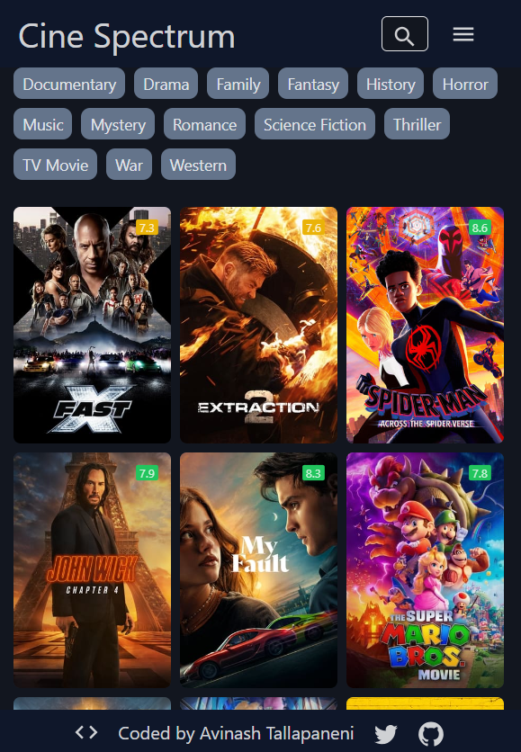
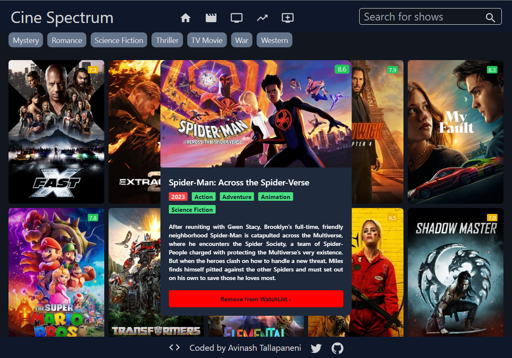
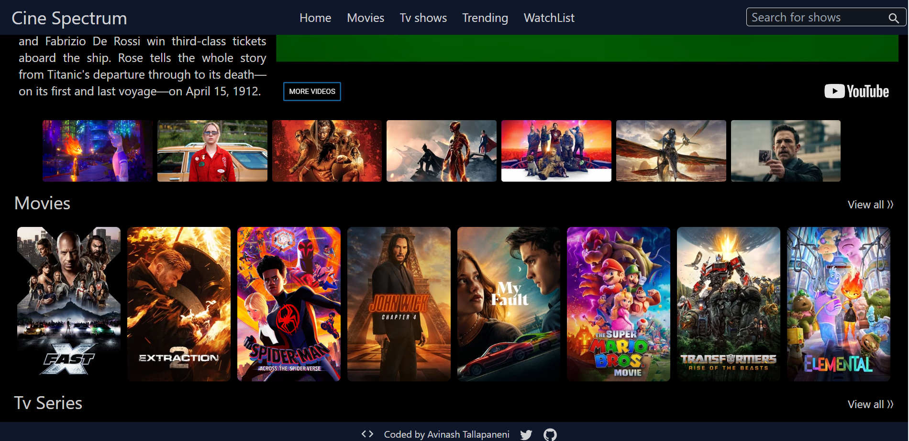

# CineSpectrum

## Introduction

CineSpectrum is a movie app that allows users to explore and discover information about movies. It provides information about popular movies, Tv Shows, Trendings and allows users to search for specific movies. Users can also view details of individual movies, such as synopsis,and ratings and release dates, and search for specific movies.

## Features

- Users can browse a collection of movies and view details such as title, poster, rating, and genre.
- The application displays information about the top-rated movies, popular movies.
- Users can search for movies by entering keywords or specific titles.
- Each movie detail page provides comprehensive information about the movie, including synopsis and release date.
- Users can save movies to their watchlist for future reference.
- The application provides recommendations based on user preferences and previously saved movies.
- The interface is intuitive and user-friendly, allowing for easy navigation and browsing.

## Technologies Used

- React.js: JavaScript library for building user interfaces
- React Router: Routing library for handling navigation in React apps
- Fetch API: JavaScript interface for making HTTP requests
- Tailwind CSS: Utility-first CSS framework for styling components
- Material UI: React components library for UI elements and icons
- React Player: React component for autoplaying YouTube videos
- The Movie Database (TMDb) API: API for retrieving movie data

## Screenshot

### Responsive Design Mobile Version



### Hover effects on cards



### Desktop version



## Getting Started

To get started with the Cine Spectrum app, follow these steps:

1. Clone the repository:

   ```bash
   git clone <repository-url>
   ```

2. Install the dependencies:

   ```bash
   npm install

   ```

3. Obtain an API key from the TMDb website (https://www.themoviedb.org/) by creating an account.

4. Create a .env file in the root directory of the project and add your API key:

   ```bash
   REACT_APP_API_KEY=YOUR_API_KEY
   ```

5. Start the development server:

   ```bash
   npm start
   ```

6. Open your web browser and visit http://localhost:3000 to access the Cine Spectrum app.

# Folder Structure

The project structure is organized as follows:

- src: Contains the source code of the Cine Spectrum app.
- components: Contains reusable components used throughout the app.
- pages: Contains the main pages of the app.
- config: Contains configuration files.
- App.js: The main component that renders the app.
- index.js: The entry point of the app.

# Contributing

Contributions to the Cine Spectrum app are welcome! If you find any bugs or have suggestions for improvements, please create an issue or submit a pull request.

## Author

My name is Avinash Tallapaneni, and I am a front-end web developer passionate about creating immersive and engaging user experiences. CineSpectrum is a project that showcases my skills and dedication to building high-quality web applications.

- Website - [Preview site on Netlify](https://cinespectrum.netlify.app/)
- GitHub - [Your GitHub Profile](https://github.com/your-profile)
- Twitter - [Twitter Profile](=https://twitter.com/TallapaneniAvi)

## Feedback

I appreciate any feedback you have on CineSpectrum. If you have any suggestions, bug reports, or general feedback, please feel free to

# License

This project is licensed under the MIT License.
Feel free to modify the content to match your project and provide additional information as needed.
